<div align="center">

# MindCare

### A private, interactive space for everyday mental wellness

[](https://mindcare-ai-app.onrender.com)
[](https://www.python.org/)
[](https://flask.palletsprojects.com/)
[](https://firebase.google.com/)

MindCare combines wellness check-ins, mood insights, guided reflection,
mindfulness exercises, and calming games in one responsive application.

**[Explore the live app](https://mindcare-ai-app.onrender.com)** ·
**[View the Mind Lab](#mind-lab)**

</div>

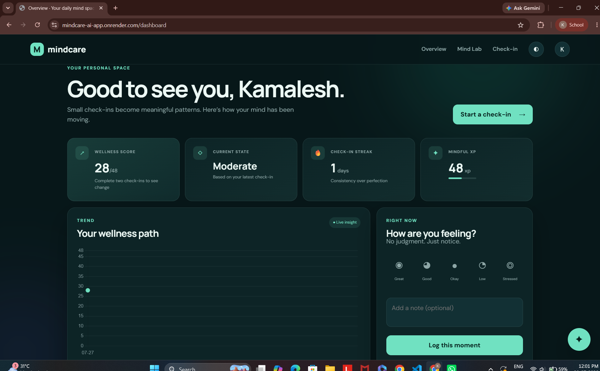

> [!IMPORTANT]
> MindCare is a wellness-support project, not a diagnostic or emergency
> service. People experiencing immediate danger should contact local emergency
> services or a trusted qualified professional.

## What MindCare offers

- **Personal wellness dashboard** — assessment trends, streaks, XP, mood
  check-ins, and recent activity in one view.
- **Guided check-ins** — a question-by-question screening experience with
  progress tracking and personalized activity suggestions.
- **Mind Lab** — interactive exercises for focus, grounding, breathing,
  memory, and mindful response.
- **Private journal** — rotating reflection prompts with entries stored in the
  user's Firebase account.
- **Mindful companion** — supportive AI conversation with a rule-based
  fallback when an AI provider is unavailable.
- **Adaptive experience** — responsive layouts plus dark and light themes.

## Product tour

### Dashboard and check-in

<table>
  <tr>
    <td width="50%">
      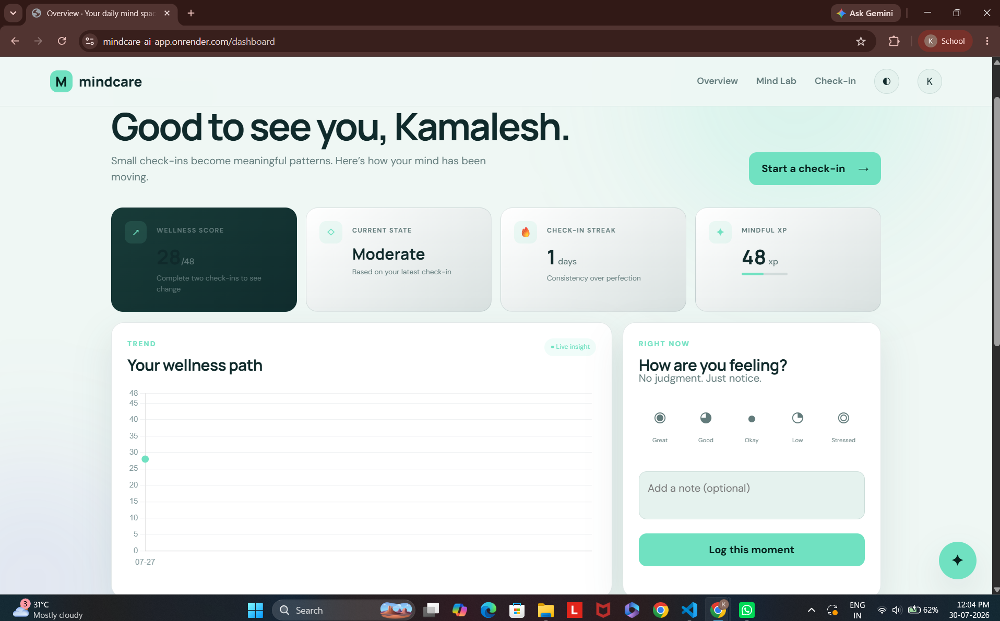
      <p align="center"><strong>Light and dark wellness dashboard</strong></p>
    </td>
    <td width="50%">
      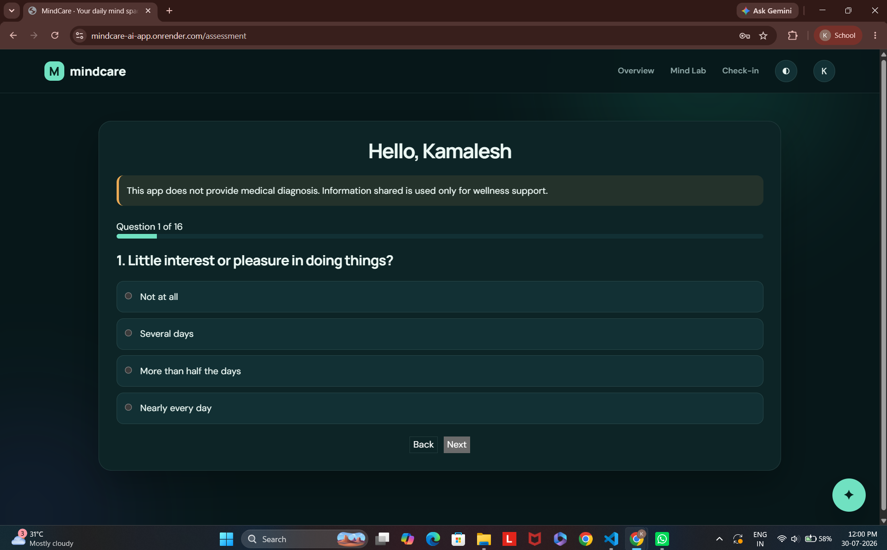
      <p align="center"><strong>Focused, step-by-step check-ins</strong></p>
    </td>
  </tr>
  <tr>
    <td width="50%">
      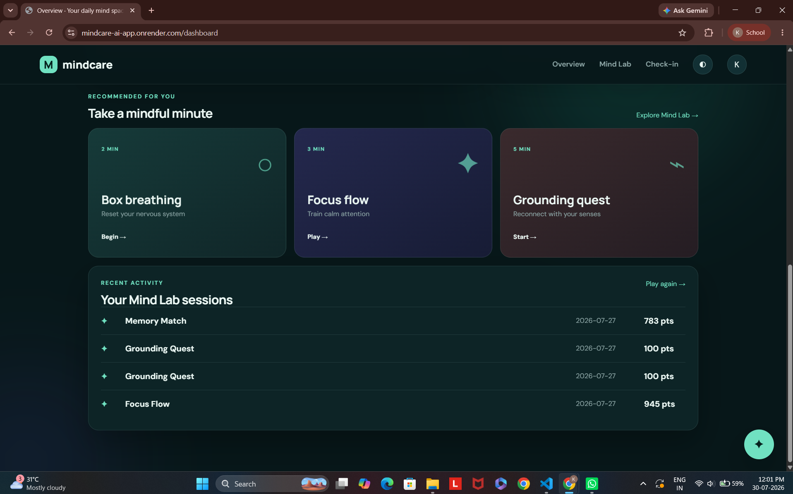
      <p align="center"><strong>Recommendations and session history</strong></p>
    </td>
    <td width="50%">
      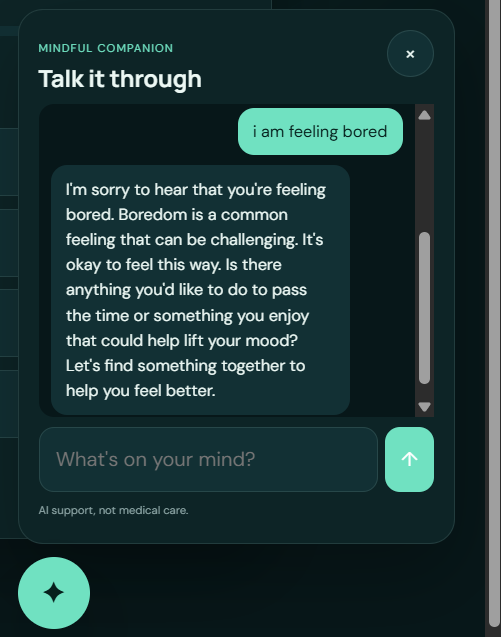
      <p align="center"><strong>Supportive mindful companion</strong></p>
    </td>
  </tr>
</table>

### Mind Lab

<p id="mind-lab">
  Short interactive activities turn mindfulness into something users can
  practice—not simply read about.
</p>

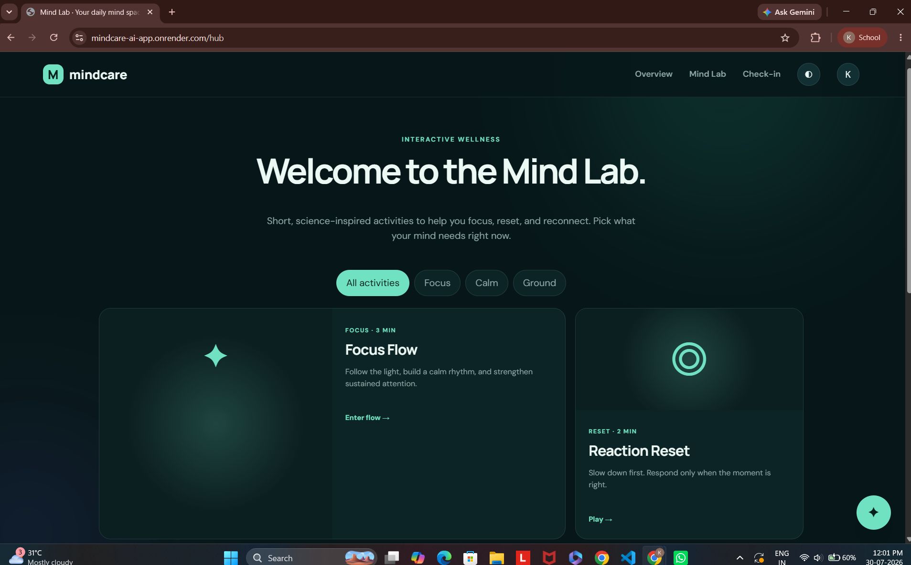

<table>
  <tr>
    <td width="33%">
      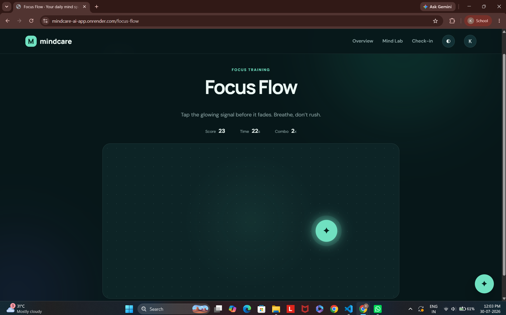
      <p align="center"><strong>Focus Flow</strong></p>
    </td>
    <td width="33%">
      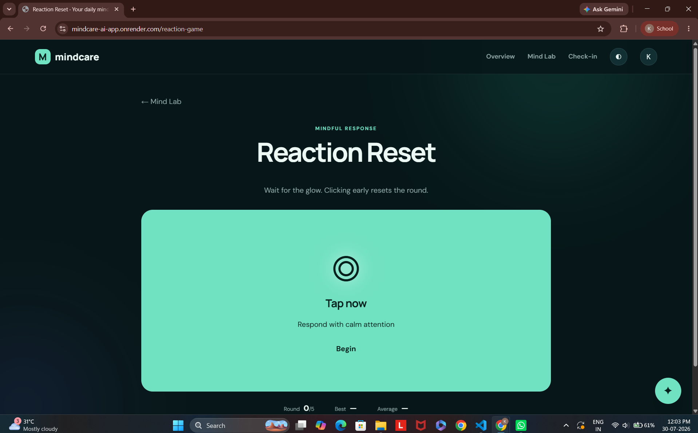
      <p align="center"><strong>Reaction Reset</strong></p>
    </td>
    <td width="33%">
      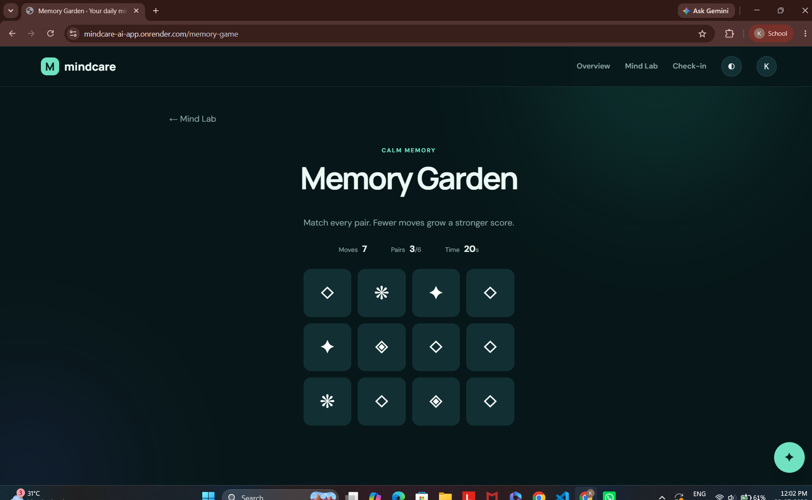
      <p align="center"><strong>Memory Garden</strong></p>
    </td>
  </tr>
</table>

<table>
  <tr>
    <td width="50%">
      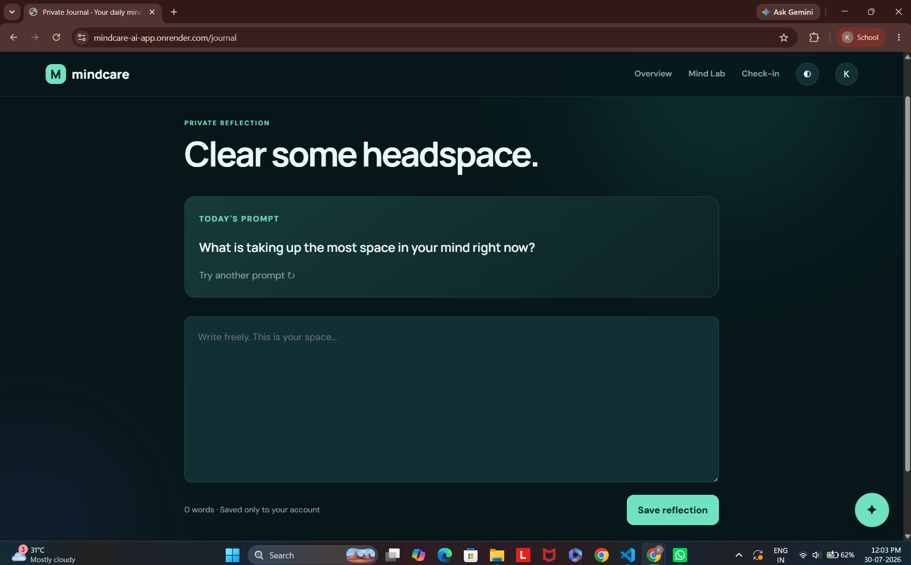
      <p align="center"><strong>Private guided reflection</strong></p>
    </td>
    <td width="50%">
      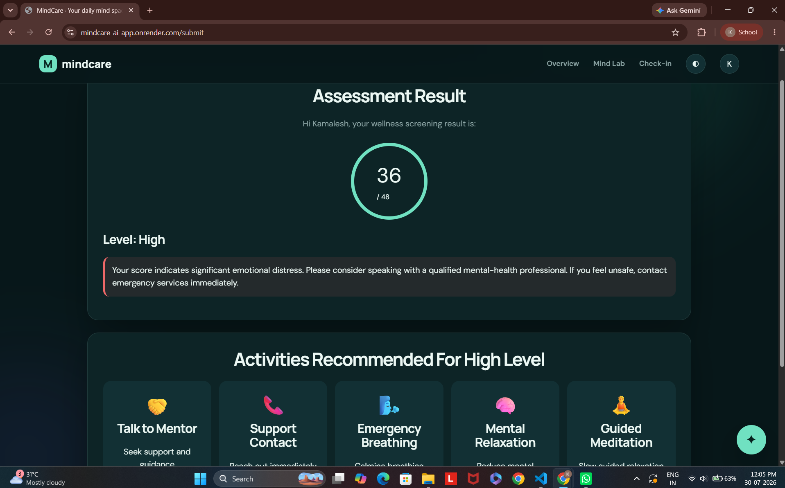
      <p align="center"><strong>Personalized next steps</strong></p>
    </td>
  </tr>
</table>

## Technology

| Layer | Technology |
| --- | --- |
| Backend | Python, Flask, Gunicorn |
| Data and authentication | Firebase Admin, Realtime Database, Werkzeug password hashing |
| Frontend | Jinja, HTML, modern CSS, vanilla JavaScript |
| Insights | Chart.js |
| AI companion | OpenRouter-compatible API with local fallback |
| Deployment | Render |

## Run locally

### 1. Clone and enter the project

```bash
git clone https://github.com/kamalesh-sankaranarayanan/mindcare-ai-app.git
cd mindcare-ai-app
```

### 2. Create a virtual environment

```bash
python -m venv venv
```

On Windows PowerShell:

```powershell
.\venv\Scripts\Activate.ps1
```

On macOS or Linux:

```bash
source venv/bin/activate
```

### 3. Install dependencies

```bash
pip install -r requirements.txt
```

### 4. Configure Firebase

Place your local Firebase service-account file at:

```text
serviceAccountKey.json
```

Create `.env`:

```env
FIREBASE_DATABASE_URL=https://your-project-default-rtdb.firebaseio.com
SECRET_KEY=replace-with-a-long-random-value
OPENROUTER_API_KEY=optional-openrouter-key
FLASK_DEBUG=true
```

### 5. Start MindCare

```bash
python app.py
```

Open `http://127.0.0.1:5000`.

## Deploy on Render

Use the following start command:

```text
gunicorn app:app
```

Configure these environment variables:

| Variable | Required | Description |
| --- | --- | --- |
| `FIREBASE_CONFIG` | Yes | Complete Firebase service-account JSON |
| `FIREBASE_DATABASE_URL` | Yes | Firebase Realtime Database URL |
| `SECRET_KEY` | Yes | Long random session secret |
| `OPENROUTER_API_KEY` | No | Enables the remote AI companion |
| `FLASK_ENV` | Yes | Set to `production` |

Set the Render health-check path to `/health`.

## Security

Never commit `.env` or `serviceAccountKey.json`. They are excluded through
`.gitignore`, but secrets should still be checked before every public push.

## License

This project is currently provided for educational and portfolio use.
